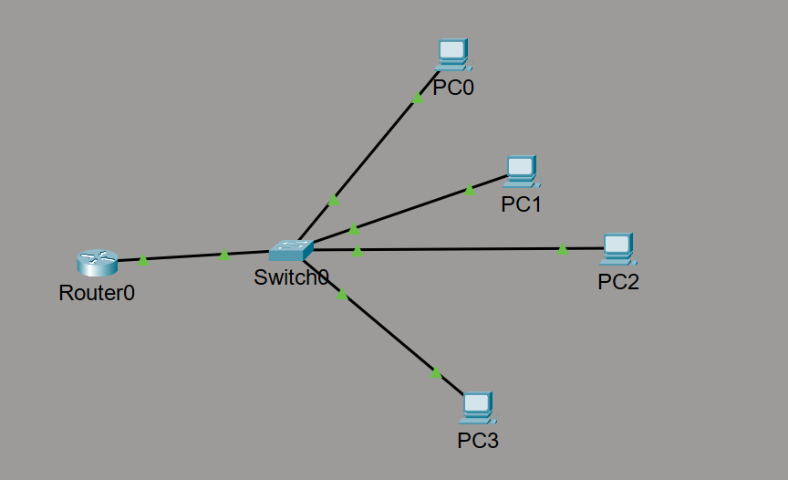

# Basic LAN + DHCP Configuration Lab
Project Overview

This lab demonstrates the configuration of a basic Local Area Network (LAN) using Cisco Packet Tracer.

The objective was to configure a router as a DHCP server using the Cisco IOS CLI, automatically assign IP addresses to client devices, and verify end-to-end connectivity within the network.

This project reinforces foundational networking concepts including:

Layer 2 switching

Layer 3 routing

IP addressing

DHCP configuration

CLI-based device management

Basic troubleshooting

Network Topology

Devices Used:

1 × Cisco 2911 Router

1 × Cisco 2960 Switch

4 × PCs

Physical Connections:

Router G0/0 → Switch G0/1

PCs → Switch Fa0/1–Fa0/4

IP Addressing Scheme
Component	Address
Network	192.168.1.0/24
Default Gateway	192.168.1.1
DHCP Range	192.168.1.10 – 192.168.1.100
Subnet Mask	255.255.255.0
DNS Server	8.8.8.8

The router interface was configured as the default gateway for all clients.

Reserved addresses (192.168.1.1–192.168.1.9) were excluded from the DHCP pool to prevent IP conflicts with infrastructure devices.

Router Configuration (CLI)
Interface Configuration
enable
configure terminal
interface g0/0
ip address 192.168.1.1 255.255.255.0
no shutdown
exit

Explanation:

Assigns the router its Layer 3 address.

Enables the interface.

Establishes the default gateway for the LAN.

DHCP Configuration
ip dhcp excluded-address 192.168.1.1 192.168.1.9

ip dhcp pool LAN_POOL
network 192.168.1.0 255.255.255.0
default-router 192.168.1.1
dns-server 8.8.8.8
exit

Explanation:

Prevents infrastructure IP conflicts.

Creates a DHCP pool for automatic IP assignment.

Defines gateway and DNS settings distributed to clients.

Verification
On Router
show ip interface brief
show ip dhcp binding

Confirmed G0/0 interface was up/up.

Verified active DHCP leases.

On Client Devices

Set IP configuration to DHCP.

Verified IP assignment in 192.168.1.0/24 range.

Successfully pinged:

Default gateway (192.168.1.1)

Other client devices

This confirmed:

Layer 1 connectivity

Layer 2 switching

Layer 3 routing

DHCP functionality

Why CLI Instead of GUI?

Although Packet Tracer provides a graphical method for DHCP configuration, this lab was intentionally completed using the Cisco IOS CLI.

Reasons:

Enterprise routers are primarily configured via CLI.

Many production environments do not provide GUI access.

CLI knowledge is required for certifications (e.g., CCNA).

CLI configuration demonstrates deeper understanding of device behavior and structure.

Using CLI reinforces command hierarchy, configuration modes, and professional networking practices.

Troubleshooting Scenario

To simulate failure:

The router interface was administratively shut down.

Clients failed to obtain DHCP addresses.

Devices defaulted to APIPA (169.254.x.x).

This demonstrated the dependency between Layer 3 gateway availability and DHCP functionality.

Restoring the interface resolved the issue.

Key Concepts Reinforced

Role of routers vs switches

DHCP DORA process (Discover, Offer, Request, Acknowledge)

Importance of default gateway configuration

IP address management

Network troubleshooting methodology

CLI operational structure

What I Learned

This project strengthened my understanding of how small networks are structured and how essential services like DHCP operate in real environments.

Key takeaways:

Networking fundamentals are critical before moving into advanced topics.

CLI-based configuration builds deeper technical confidence.

Proper IP planning prevents misconfiguration and conflict.

Troubleshooting requires layer-by-layer thinking.

This lab serves as a foundational step in my networking and cybersecurity learning journey.
